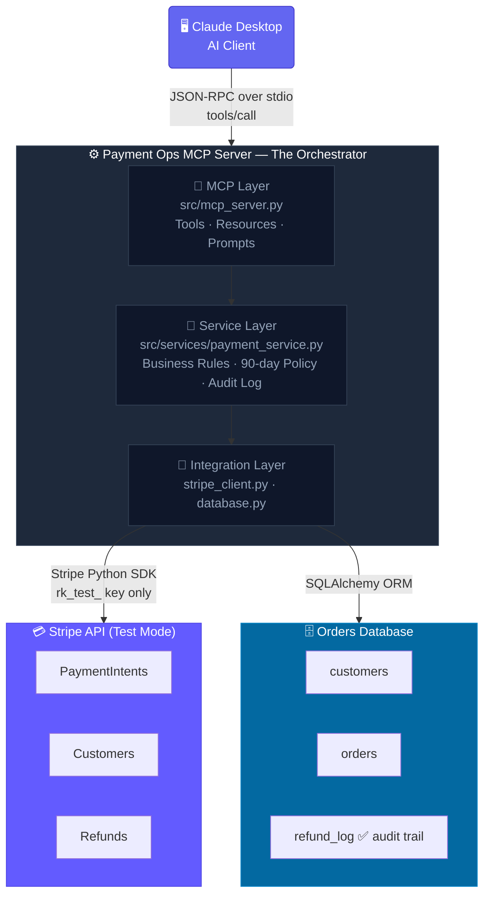

# AI Payment Operations Assistant (MCP Server)

> An MCP server that lets an AI assistant handle payment support — look up customers, review charges, and issue refunds — by orchestrating between **Stripe** and an **internal orders database**, with human approval required before any money moves.

**Stack:** Python · MCP SDK · Stripe API · SQLAlchemy · pytest  
**Safety:** Stripe TEST MODE only — no real money moves

---

## Demo

> **Prompt typed into Claude Desktop:**
> *"A customer, sarah@example.com, emailed about a double charge. Look into it and refund the most recent payment."*

```
STEP 1  Claude calls lookup_customer("sarah@example.com")
        → queries Orders DB → finds Sarah + Stripe customer ID

STEP 2  Claude calls list_payments(customer="cus_xxx")
        → queries Stripe (test mode) → returns recent charges

STEP 3  Claude PAUSES:
        "I found a duplicate $49.99 charge. Refund the most recent one? Please confirm."
        → human-in-the-loop gate before any money moves

STEP 4  You reply "yes"
        → Claude calls issue_refund(confirmed=True)
        → refund issued in Stripe
        → order status updated + audit row written to DB

STEP 5  Claude confirms:
        "Refunded $49.99 to Sarah (re_3To18wCLuf9LMqJ11xb4XutS).
         Logged in orders DB as duplicate-charge reversal."
```

*Add demo GIF here after recording*

---

## Why This Exists

Stripe ships an official MCP server — but it only knows Stripe. Real companies wrap the payment provider with internal data and business rules. This server is that orchestration layer:

- Joins Stripe payment data with internal order records via `stripe_customer_id`
- Enforces refund policy (no refunds older than 90 days)
- Requires human confirmation before moving money
- Writes a full audit log of every refund to the orders DB

That's the layer every company has to build itself. The provider can't.

---

## Architecture



**Three layers inside the server:**

| Layer | File | Job |
|---|---|---|
| 🔌 MCP | `src/mcp_server.py` | Define tools/resources/prompts, talk JSON-RPC |
| 🧠 Service | `src/services/payment_service.py` | Orchestrate Stripe + DB, enforce rules |
| 🔗 Integration | `src/integrations/stripe_client.py` + `src/db/database.py` | Talk to Stripe SDK and the DB |

---

## Tools

| Tool | Type | What it does |
|---|---|---|
| `lookup_customer` | Read | Merges internal DB record + live Stripe status by email |
| `list_payments` | Read | Lists recent Stripe PaymentIntents for a customer |
| `get_order_history` | Read | Returns full order history from internal DB |
| `issue_refund` | **Write** | Two-step: preview → confirm → refund Stripe + log DB |
| `create_payment_link` | Write | Generates a Stripe test payment link |
| `revenue_summary` | Read | Aggregates paid orders over a date range |
| `flag_for_review` | Write | Flags a charge in the audit log for manual review |

Plus 2 **resources** (`customer://email`, `payment://charge_id`) and 2 **prompts** (`daily_revenue_report`, `find_refund_candidates`).

---

## Safety Design

Three layers — never trust the model alone for money-moving actions:

1. **Human-in-the-loop gate** — `issue_refund` requires `confirmed=True`, which the model only sets after explicitly asking the user
2. **Server-side business rule** — refunds older than 90 days are rejected regardless of what the model requests
3. **Least-privilege Stripe key** — restricted key scoped to Charges + Customers + Refunds only, limits blast radius

---

## Database Schema

```
customers
  id (uuid, pk)
  email (unique)
  name
  stripe_customer_id    ← join key to Stripe

orders
  id (uuid, pk)
  customer_id (fk)
  stripe_charge_id      ← Stripe PaymentIntent ID (pi_xxx)
  amount_cents
  currency
  status (paid / refunded / partially_refunded)
  created_at

refund_log              ← audit trail
  id (uuid, pk)
  order_id (fk)
  stripe_refund_id
  amount_cents
  reason
  refunded_by ("ai-assistant")
  created_at
```

---

## Setup

### 1. Clone and install

```bash
git clone https://github.com/srik4442/Payment-Ops-mcp.git
cd Payment-Ops-mcp
python3 -m venv .venv
source .venv/bin/activate
pip install -r requirements.txt
```

### 2. Get a Stripe test key

1. Create a free account at [stripe.com](https://stripe.com) (test mode, no card needed)
2. Go to **Developers → API keys → Create restricted key**
3. Grant **Write** access to: Charges and Refunds, Customers, Payment Intents, Payment Links, Products
4. Copy the `rk_test_...` key

### 3. Configure environment

```bash
cp .env.example .env
# Edit .env and add your key:
# STRIPE_API_KEY=rk_test_your_key_here
# DATABASE_URL=sqlite:///./payments.db
```

### 4. Seed test data

```bash
python scripts/seed.py
```

Creates 5 test customers in both your local DB and Stripe, each with 2–3 test charges.

### 5. Connect Claude Desktop

Add to `~/Library/Application Support/Claude/claude_desktop_config.json`:

```json
{
  "mcpServers": {
    "payment-ops": {
      "command": "/absolute/path/to/.venv/bin/python",
      "args": ["/absolute/path/to/src/mcp_server.py"],
      "env": {
        "STRIPE_API_KEY": "rk_test_your_key_here",
        "DATABASE_URL": "sqlite:////absolute/path/to/payments.db"
      }
    }
  }
}
```

Restart Claude Desktop. You should see the `payment-ops` server connected.

### 6. Run the demo

Type into Claude Desktop:

> "A customer, sarah@example.com, emailed about a double charge. Look into it and refund the most recent payment."

---

## Tests

```bash
python -m pytest tests/ --cov=src -v
```

24 tests · 99% coverage on business logic · Stripe client fully mocked (no real API calls in tests)

```
tests/test_payment_service.py::TestLookupCustomer::test_lookup_customer_merges_db_and_stripe PASSED
tests/test_payment_service.py::TestIssueRefund::test_issue_refund_preview_when_not_confirmed PASSED
tests/test_payment_service.py::TestIssueRefund::test_issue_refund_writes_refund_log_when_confirmed PASSED
tests/test_payment_service.py::TestIssueRefund::test_issue_refund_rejected_for_charge_older_than_90_days PASSED
...
```

---

## Tech Decisions

**Why MCP instead of a backend script?**  
A script automates one fixed workflow. MCP exposes capabilities to any AI client so a human can drive novel, multi-step support tasks in natural language — without pre-coding every path.

**Why SQLite?**  
Zero-config for a portfolio project. The ORM (SQLAlchemy) makes swapping to Postgres a one-line config change.

**Why test mode only?**  
Test mode uses the identical Stripe API and code path as live — the only difference is the key prefix. It's the correct professional choice for a portfolio project. Switching to production is one environment variable.

**Why a restricted Stripe key?**  
Least-privilege: the key can only touch Charges, Customers, and Refunds. Even if the key were compromised, the blast radius is contained. This is standard practice in production payment systems.

**Why store `pi_xxx` IDs (PaymentIntent) instead of `ch_xxx` (Charge)?**  
Modern Stripe workflows are built around PaymentIntents. Refunds issued via `payment_intent` parameter work reliably across all payment methods, while legacy `charge` IDs can cause mismatch issues.

---

## Safety Notice

This project runs entirely in **Stripe test mode**. No real money moves. The `rk_test_` prefix on the API key ensures this at the Stripe level regardless of any code-level mistakes.

Never commit a live key (`sk_live_` / `rk_live_`) to this repository.

---

## Resume Bullet

**AI Payment Operations Assistant (MCP Server)** · Python, MCP SDK, Stripe API, SQLAlchemy, pytest

- Built a Model Context Protocol server that lets AI assistants perform payment support operations by orchestrating between the Stripe API and an internal order database, exposing 7 tools, resources, and prompt templates
- Implemented human-in-the-loop confirmation and server-side business rules to gate money-moving actions, with a full refund audit log written to the database for every transaction
- Applied production payment patterns — least-privilege restricted API keys, idempotency, and prompt-injection mitigation — and validated orchestration logic with a mocked-Stripe pytest suite at 99% coverage
